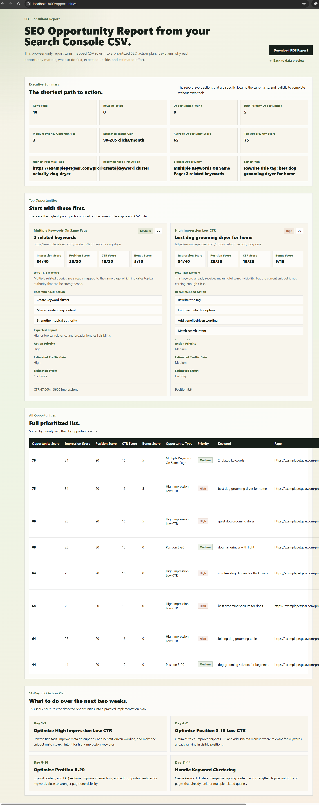

# GSC SEO Opportunity Finder



## 项目介绍 / Project Introduction

GSC SEO Opportunity Finder is a lightweight browser-based tool for turning Google Search Console CSV exports into an actionable SEO opportunity report.

The first MVP version focuses on local CSV analysis. Users upload a GSC Performance CSV, map the required fields, preview cleaned data, detect SEO opportunities, view a consultant-style report, and export it as a PDF.

No Google API, login, database, payment, or AI is required in the current MVP.

## 功能列表 / Features

- Local CSV upload in the browser
- Drag-and-drop file upload
- CSV, TSV, TXT, XLSX, and XLS parsing
- Google Search Console field auto-detection
- Manual field mapping when auto-detection fails
- Data preview for mapped CSV rows
- Local data cleaning for CTR, position, clicks, and impressions
- Rule-based SEO opportunity detection
- Dynamic Opportunity Score with score breakdown
- SEO Consultant Report layout
- Rule-based SEO Action Plan
- Browser PDF export via `window.print()`

## MVP Progress

## MVP1 - Project Skeleton and CSV Upload

- Created the Next.js + TypeScript project structure
- Added homepage UI
- Added CSV upload area
- Added privacy note
- Added example report entry
- Parsed CSV locally with Papa Parse
- Displayed detected fields and first 10 rows

## MVP2 - Field Detection and Mapping

- Added automatic field detection for required GSC fields
- Added manual field mapping UI
- Added `Identified`, `Missing`, and duplicate-field states
- Blocked the next step until all required fields are mapped

## MVP3 - Data Preview Page

- Added `/preview`
- Stored mapped CSV data in browser `sessionStorage`
- Displayed first 10 mapped rows
- Displayed rows and columns summary
- Added placeholder button for opportunity analysis

## MVP4 - Opportunity Detection Engine

- Added local opportunity detection rules
- Detected High Impression Low CTR opportunities
- Detected Position 8-20 opportunities
- Detected Position 3-10 Low CTR opportunities
- Detected pages with multiple keywords
- Added `/opportunities`

## MVP5 - SEO Consultant Report

- Upgraded `/opportunities` into a consultant-style report
- Added Executive Summary
- Added Top Opportunities
- Added All Opportunities
- Added 14-Day SEO Action Plan
- Added why/action/impact/effort explanations for each opportunity

## MVP6 - PDF Report Export

- Added `Download PDF Report`
- Used browser-native `window.print()`
- Added print-specific CSS
- Kept export fully local in the browser

## MVP7 - Real GSC CSV Compatibility

- Expanded field alias support
- Added data cleaning for CTR, position, clicks, and impressions
- Added `Rows Loaded`, `Rows Valid`, and `Rows Rejected`
- Added required field error handling
- Added real-format sample CSV

## MVP8 - Dynamic Opportunity Score

- Replaced fixed scores with dynamic local scoring
- Added Impression Score
- Added Position Score
- Added CTR Score
- Added Page Authority Bonus
- Added score breakdown to report cards and tables

## MVP9 - SEO Action Plan

- Added rule-based action plan fields for each opportunity
- Added specific recommended actions by opportunity type
- Added Action Priority
- Added Estimated Traffic Gain
- Added Biggest Opportunity and Fastest Win to Executive Summary

## 安装步骤 / Installation

Install Node.js first if it is not already installed.

Then install project dependencies:

```powershell
cd D:\Codex\Web出海\GSC-SEO-Opportunity-Finder
npm.cmd install
```

## 本地运行方法 / Local Development

Start the local development server:

```powershell
npm.cmd run dev
```

Open:

```text
http://localhost:3000
```

## Build

Create a production build:

```powershell
npm.cmd run build
```

## CSV 格式要求 / CSV Format Requirements

The tool expects a Google Search Console Performance CSV with these required fields:

- `query`
- `page`
- `clicks`
- `impressions`
- `ctr`
- `position`

## Supported Field Aliases

Query:

- `query`
- `Query`
- `Search Query`
- `Top Query`
- `Keyword`

Page:

- `page`
- `Page`
- `URL`
- `Landing Page`

Clicks:

- `clicks`
- `Clicks`

Impressions:

- `impressions`
- `Impressions`

CTR:

- `ctr`
- `CTR`
- `Click Through Rate`

Position:

- `position`
- `Position`
- `Average Position`

## Data Cleaning

CTR supports:

- `0.43%`
- `0.43`
- `0.0043`

Position supports:

- `8.5`
- `8,5`

Clicks and impressions are cleaned by removing commas, spaces, and invalid characters.

## Supported File Formats

- Google Search Console CSV
- TSV export
- TXT comma/tab delimited file
- Excel `.xlsx`
- Excel `.xls`

## PDF 导出说明 / PDF Export

Go to:

```text
http://localhost:3000/opportunities
```

Click:

```text
Download PDF Report
```

The browser print dialog will open. Choose `Save as PDF` or `Microsoft Print to PDF` to export the report.

## Current MVP Limitations

- No Google Search Console API
- No user accounts
- No database
- No payment flow
- No AI-generated recommendations
- Data is stored only in the current browser session

## Sample Dataset Formats

The `public/samples/` folder includes upload test files for CSV, TSV, tab-delimited TXT, XLSX, and XLS workflows:

- `gsc-high-impression-low-ctr.csv`
- `gsc-keyword-cluster.tsv`
- `gsc-near-page-one.txt`
- `gsc-good-performance.xlsx`
- `gsc-real-world-sample.xls`

## Negative Test Cases

The `public/samples/errors/` folder includes intentionally invalid upload files for validation testing:

- `gsc-missing-required-fields.csv`: missing the `query` column; should show `Required GSC fields missing`.
- `gsc-empty-file.csv`: blank CSV content; should show `Empty file`.
- `gsc-invalid-numeric-values.csv`: invalid `clicks`, `impressions`, `ctr`, and `position` values; should trigger row rejection or validation warnings.
- `gsc-invalid-numeric-values.xls`: legacy Excel file with invalid `clicks`, `impressions`, `ctr`, and `position` values; should show `Invalid numeric values detected`.
- `gsc-unsupported-format.json`: unsupported JSON upload; should show `Unsupported file type`.
- `gsc-no-worksheet-data.xlsx`: first worksheet has no rows; should show `No worksheet data found`.
